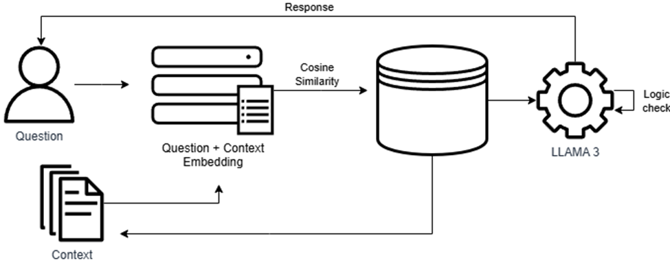

# Data Warehouse Data & Metadata Retrieval Using Large Language Models
## Proof of Concept
This project demonstrates a robust framework for retrieving and analyzing data and metadata from a data warehouse using large language models (LLMs). Structured data is stored and managed in a relational SQL database, while unstructured documents are indexed in Pinecone for rapid, vector-based retrieval. A Streamlit interface provides an intuitive, interactive platform for data exploration, visualizations, and model output evaluation. Machine learning analytics uncover insights and patterns from the data, with LLMs enhancing interpretability of these results. By integrating structured databases, vector search, interactive dashboards, and advanced ML-driven analysis, this approach delivers a versatile and powerful solution for data-driven decision-making.

